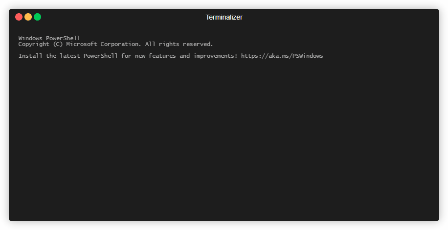

# Conway's Game of Life

A simple implementation of the [Game of Life](https://en.wikipedia.org/wiki/Conway%27s_Game_of_Life).

## Build (Windows Only)

Open a Powershell command prompt and enter the following command
```ps1
.\build.ps1
```

## Quick Start

Run the following command in a Powershell prompt
```ps1
.\run.ps1
```

and then you will see the evolution of the lives on a 2D world



## Usage

```ps1
.\run.ps1 [NumRows [NumCols [NumInitLiveCells]]]
```

where 
- `NumRows` is the number of rows in the 2D world
- `NumCols` is the number of columns in the 2D world
- `NumInitLiveCells` is the number of live cells randomly scattered in the initial 2D world